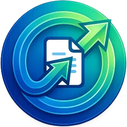
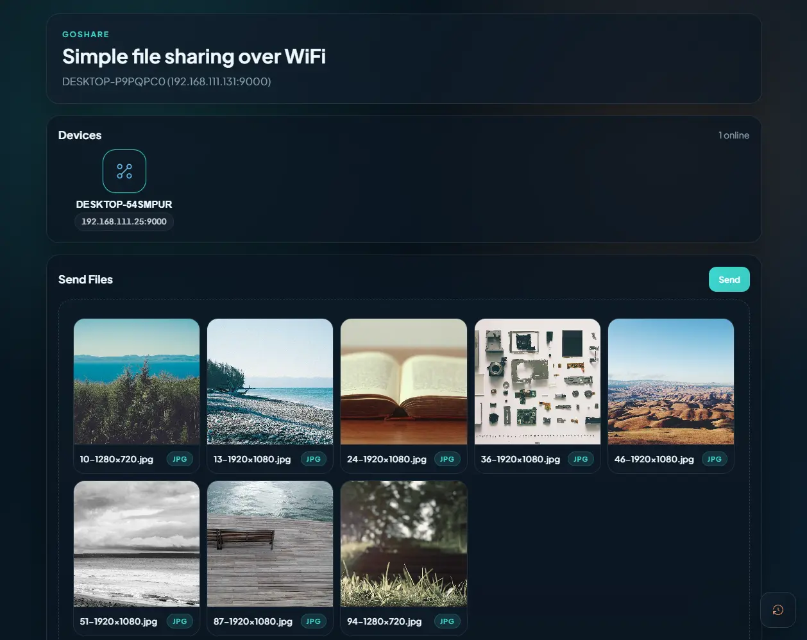

<p align="center">
	
</p>

# GoShare

[](https://go.dev/) [](https://wails.io/) [](https://developer.mozilla.org/en-US/docs/Web/HTML) [](https://developer.mozilla.org/en-US/docs/Web/CSS) [](https://developer.mozilla.org/en-US/docs/Web/JavaScript) [](https://en.wikipedia.org/wiki/Wi-Fi)

GoShare is a simple file sharing app for local Wi-Fi networks. It discovers nearby devices automatically and lets you send files directly between them without uploading anything to the cloud.



## Features

- Discover online devices on the same local network
- Send one or more files to a selected device
- Receive incoming transfers with accept or reject controls
- Pause, resume, or cancel outgoing transfers
- Track transfer progress and recent history
- Preview image files before sending
- Save incoming files into a local received folder

## How It Works

GoShare uses UDP broadcast for device discovery and TCP for file transfer.

- UDP discovery port: `9999`
- TCP transfer port: `9000`

Each app instance advertises itself on the local network, detects other GoShare devices, and keeps the device list updated while they are online.

## Requirements

- Windows or Linux
- Go 1.22 or later
- A local Wi-Fi network shared by the sender and receiver
- On Linux, install the desktop dependencies required by Wails and WebKitGTK

## Running the App

From the project root, run:

```bash
go run -tags dev .
```

The app will open a desktop window and start discovering devices on the network.

## Building

To build for Windows, run:

```bash
go build -tags production -ldflags="-s -w -H=windowsgui" -o GoShare.exe .
```

To build for Linux, run:

```bash
go build -tags production -o GoShare
```

If you are building on Linux for the first time, make sure the system packages required by Wails are installed before running the build.

## File Receive Folder

Incoming files are saved into a received folder next to the executable. If the executable location cannot be resolved, GoShare falls back to a local received folder in the current directory.

## Project Structure

- `app.go` - application lifecycle, discovery, transfer, and app APIs
- `main.go` - Wails entry point and window configuration
- `app/connection` - network connection management
- `app/discovery` - device discovery service
- `app/transfer` - file transfer manager and protocol handling
- `app/models` - shared data models
- `app/utils` - checksum and network helpers
- `frontend/dist` - bundled frontend assets used by the desktop app

## Notes

- The project uses Wails for the desktop shell.
- The frontend in this repository is shipped as a static bundle in `frontend/dist`.
- If you want to replace the UI later, `frontend/src` is available as a placeholder for a new source app.

## Security Note

- GoShare is designed for trusted local networks only.
- Only accept transfers from devices you recognize.
- File discovery and transfer happen over the LAN, not through a cloud service.
- If you use it on a shared network, make sure the network is secured and the devices are trusted.

## License

This project is licensed under the MIT License. See [LICENSE](LICENSE) for the full text.
